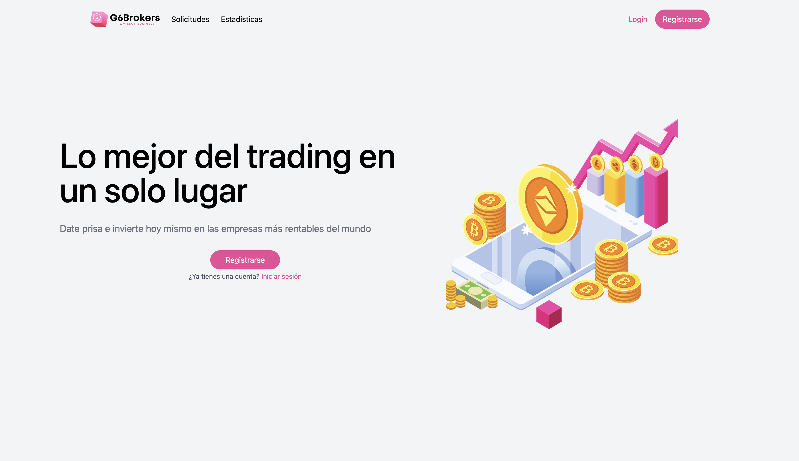
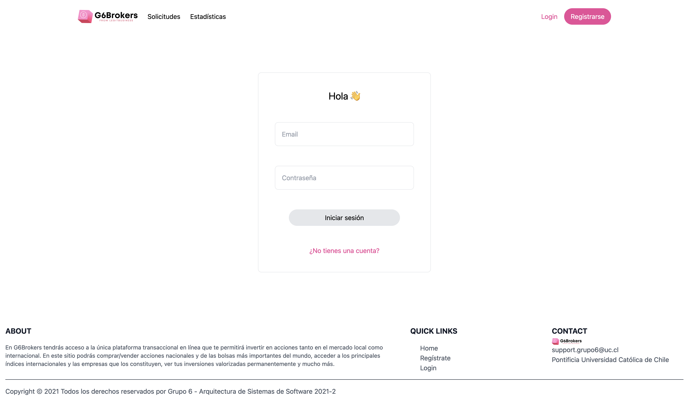
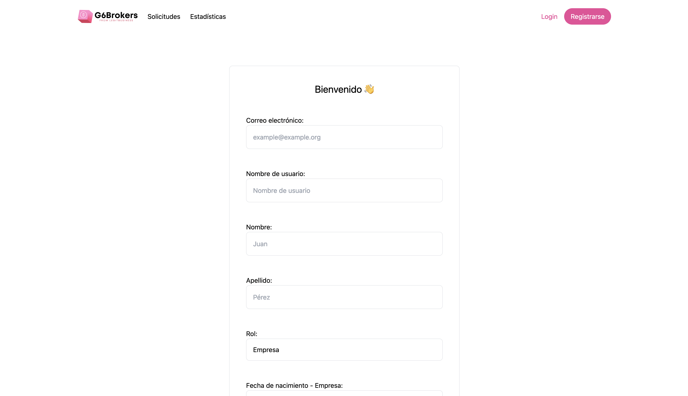

<h1> ✨ Portafolio Matias Masjuan ✨ </h1>

## Hola! 👋

Mi nombre es Matías Masjuan, recién egresado de Ingeniería Civil en Computación con Major en Ingeniería de Software y Minor en Data Science & Analytics en la Pontificia Universidad Católica de Chile. 👨‍🎓

A continuación se muestran distintos proyectos que he realizado a lo largo de mi transcurso universitario además de proyectos personales. Estos fueron realizados en equipos de tres integrantes por lo general, por lo que **no son exclusivamente míos**. 

Lamentablemente, debido a problemas técnicos asociados a cambios de plataforma de *hosting* y mantención, algunos de estos proyectos se encuentran fuera de servicio. Durante el verano me dedicaré en corregirlos 🔧

# KittyJump 🐱

KittyJump es un juego realizado en Unity con C# el cual fue exportado mediante WebGL y está disponible para jugar en itch.io

Es similar al juego DoodleJump, pero con un gatito. El objetivo es llegar a lo más alto posible sin caerse y alcanzar el mayor puntaje posible. 

Los puntajes se encuentran almacendos en un servidor deployeado en Fly.io realizado en Node.js con Express y una base de datos en Postgresql. Cada vez que uno pierde en el juego, se registra el puntaje en este servicio externo, lo cual permite hacer consulta de HighScores dentro del juego.

* [Link KittyJump](https://maytarok.itch.io/kittyjump?secret=O5KMzTtdGS7ecb23oVp2oTSzrr8)

# FindHomy 🏡

FindHomy es una aplicación de prueba similar a lo que es AirBnB, en la cual usuarios pueden registrarse, visitar y publicar propiedades, además de agendar reuniones para la compra/arriendo de estas. Lamentablemente, el backend estaba *hosteado* en Heroku, pero tuvo que ser retirada luego de que la empresa decidiera quitar el *free-tier*.

El backend era una aplicación en Node.js con Koa, la cual utilizaba un orm llamado sequelize para interactuar con una base de datos en Postgresql. El frontend está desarrollado en React deployeado en Netlify. Este último es funcional, pero al no tener la api activa no es muy funcional.

* [Link Findhomy](https://find-homy.netlify.app/)
* [Link Documentación](https://documenter.getpostman.com/view/16206670/TzeTKq3n)

# DCCitas 🍷

Primera aplicación web creada. Hecha en Ruby on Rails con base de datos en Postgresql. Lamentablemente está deployeada en Heroku por lo que actualmente no es funcional. Sin embargo, existe el siguiente link con la Demo presentada al final del curso.
* [Demo DCCitas](https://youtu.be/0yxpABOVMQ4)

# G6Brokers 💰

G6Brokers es una aplicación de prueba donde es posible hacer exchange de criptomonedas. Fue elaborada en Vue.js. Fue levantada en una instancia EC2 en AWS. Por temas económicos, tuvo que ser retirada luego de que acabara el curso para evitar cobros innecesarios. No se tiene una aplicación accesible, pero a continuación se muestran diferentes capturas:

